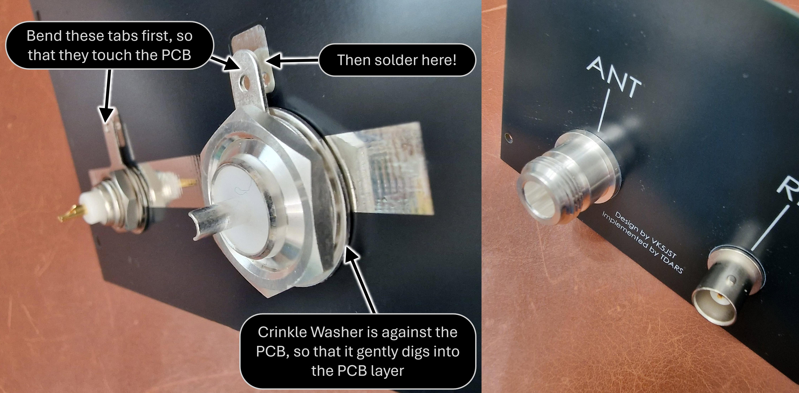

# Antenna Analyzer
This repository contains the detail to construct a VHF/UHF antenna analyzer instrument designed by VK5JST (Amateur Radio, May 2005). Refer to the original article for more information concerning it. The design was entered into KiCad software by TDARS, to create the printed circuit boards described here.

# Overview
The analyzer has two connections; one from the radio transmitter (2W max, but you could use an attenuator), and one to the antenna. Note that the instrument also supports HF, but you'll still need to limit power to 2W max, or use an attenuator.

There's a 4-position rotary selector knob. By using that, it is possible to select SWR or R/Z modes, and observe these values on the built-in moving-coil meter movement. The meter is fitted with a detailed scale, although the diagram here just shown LO/HI.

# Circuit Diagram

# One-Time Calibration
To calibrate the instrument one-time after building it, you just need a HF signal source of adjustable power. Do the following:

(1) Connect a low-power HF source to the RF input on the instrument, and ensure that nothing is attached to the antenna connector (to simulate a bad antenna)

(2) Set the selector knob to the leftmost position which is the **Check Input** position.

(3) Slowly ramp up the input power until the meter scale reaches the center of the '**INPUT OK**' section, which may occur at about 1W of transmitted power

(4) Set the selector knob to next position (**Set FSD**), and then adjust the **front panel potentiometer** until the needle reaches the full scale position

(5) Set the selector knob to the next position (**SWR**), and adjust the trimmer resistor labeled **TP1** to place the needle at the full scale position again

(6) Set the selector knob to the last remaining position (**R/Z**) and adjust the trimmer resistor labeled **TP2** to place the needle again at the full scale position

(7) All is done!

# Using It

In normal use, connect the instrument up to your transmitter (maximum 2W! or use an attenuator) as well as your antenna. Then, follow these steps:

(1) Turn the selector knob to the Set FSD position, and then, at your desired transmit frequency, transmit at approximately half a Watt, or 1W (2W max! or use an attenuator). Turn the rotary potentiometer on the front panel until the meter needle is at max.

(2) Now you are free to select either the SWR or R/Z positions, and examine the values. A good SWR value will be low (leftmost on the meter dial), and a good impedance value will be 50 ohms (close to the center of the meter dial).

(3) By slowly varying the transmit frequency, you should be able to find the antenna resonant frequency, by looking at the impedance. Picture a valley. If you traverse from low to high frequency, then the impedance will reduce down toward 50 ohm, and then beyond a certain frequency it will start increasing. The impedance valley bottom location is where the antenna is resonant.

# Main Circuit Board (with snap-off areas)
The instrument is built using a printed circuit board that has snap-away sections for the rotary controls. Most of the parts are large surface-mount, which is easy to assemble using a good pair of tweezers and a decent soldering iron. Note: Don't solder the BNC and N sockets, until you've looked at the section further below titled 'End Panel'.

This is what the underside looks like:

As you can see, there are snap-off areas for the controls. Note that the PCB manufacturer may ask for an additional charge subsequently as a result of that. For instance, see JLC PCB rules here: https://jlcpcb.com/help/article/in-what-cases-will-there-be-charged-extra

# Alternative Main Circuit Board (with no snap-off areas)
If desired, you could order a PCB without the snap-off areas. You'd need to manually wire the controls (rotary switch and potentiometer) and resistor R8, or use a Flex PCB which is described further below. 

# Wire Link! And Flex Connector Orientation

Important - don't forget to solder the wire link on the main board! It should be soldered on the underside as shown in the photo (so that the PCB ground plane can shield it from the component side).

Also, note how the flex connector is oriented in the photo below. This orientation will hopefully allow it to make good contact with the copper side of the flex PCB.

# Enclosure Planning
You could 3D-print an enclosure if desired. There are two existing 3D printed enclosure styles, developed by Paul M0PLA.

The difference is that style V3 has a sloped top. To print either of them, download the [style V1 STL file](https://github.com/shabaz123/antenna-analyzer/raw/refs/heads/main/3d-renders/swr-box-v1.stl) or the [style V3 STL file](https://github.com/shabaz123/antenna-analyzer/raw/refs/heads/main/3d-renders/swr-box-v3.stl)

A wood enclosure is another possibility.
For the full set of dimensions, refer to the "Dimensions" section further below.

Use the front panel PCB, and the end panel PCB, as guides to create the enclosure, and confirm they will fit.

# Flex PCB Controls
If you like, you could use a flexible PCB for the controls and resistor R8. This is what the design looks like:

Here is the 3D view of it:

Here is the underside view of it:

The potentiometer and rotary switch bodies both have a little protrusion key that is used to prevent them rotating along with the shaft. The top panel PCB does not have keyholes for that, so you'll need to dremel or file off the protrusions or find some other way of removing them. I used heavy-duty wire cutters, but it will probably damage the cutters slightly. 
You could use epoxy glue to secure the potentiometer bodies as shown in the photos below. I decided not to use the shaft nuts to secure the potentiometer and rotary switch, because I wanted to recess them a little bit, and I just used glue. Perhaps a 3D-printed mount could be glued onto the underside of the top panel, to make them flush from the top side.

Here is what it looks like when the flex PCB is assembled:

To use this flex PCB, you'll need to attach a Flat Flexible Cable (FFC) connector onto the mainboard:

The connector is available from AliExpess, search for **FPC 2.54mm Pitch Connector Flat Flexible Cable** and select an 8-way connector. There are straight and right-angle options. The 3D render above shows a right-angle connector, but a straight connector is probably easier to install without hitting the meter. 

## Important: Connector Orientation
Install the connector such that the Pin 1 marking on the flexible PCB mates with Pin 1 on the mainboard, which is indicated by a square pad. 

NOTE: You also have to ensure that the springy side of the terminal inside the connector mates with the copper side of the flexible PCB, to make good contact. If you're unsure, use a multimeter set to continuity mode and check there is good contact before soldering the connector. This will help eliminate the risk of installing the connector the wrong way around.

# End Panel
If you don't have the ability to drill holes, then optionally, an end panel printed circuit board can be created too. This eliminates needing to drill any holes.

The BNC and N sockets are simply screwed onto the panel (order is: put crinkle washer on first, then the ring tag, then the nut), and the ring tags can be soldered down (it will be easier if you slightly bend the ring tag terminal beforehand).

After you've done that, the BNC and N connectors can be soldered to the main board PCB and then solder the edge of the main board against the horizontal bare copper area on the end panel. 

NOTE: It's probably a good idea to use epoxy glue to secure the RF connectors to their nuts, and to the PCB, so that the RF connectors cannot rotate even slightly (which would tear the RF connector center pin connection to the PCB tracks!

# Meter Dial
To remove the existing meter dial (100uA scale) remove the meter side ears (they look like paddles, they might not be fitted to the meter as supplied). Next, carefully remove the black bezel from the meter. It just unclips, if you gently bend the side lobes of the bezel just a fraction of a degree (careful, they can break!).

There is a white wedge-shaped meter zero position adjustment on the front of the meter. Rotate it so that the white wedge is centered for now. Next, unscrew the two small screws that hold the front clear plastic to the meter, and carefully lift off the front plastic. This is easier when that white wedge has been centered. 

You'll see that the meter dial/scale is a thin aluminium plate that has been painted white with black lettering. Unscrew the two screws that hold the meter dial to the meter, and then slide it out, without accidentally bending the meter needle!

There are two options as to how to replace the meter dial.

(1) Print off the [SVG meter dial](https://github.com/shabaz123/antenna-analyzer/raw/refs/heads/main/images/meter-dial-antenna-analyzer.svg) onto a sheet of paper (you may have to experiment with it to size it perfectly) and then cut and glue it to the plain aluminium side of the existing meter dial. An excellent thin watery glue is "Tombow Mono Multi Liquid Glue" intended for cardboard.

(2) Use the [meter dial Gerber file](https://github.com/shabaz123/antenna-analyzer/raw/refs/heads/main/gerbers/meter-dial-antenna-analyzer-gerbers.zip) and upload it to a PCB manufacturer website, selecting 0.8 mm thickness aluminium PCB. When it arrives, it should be a direct replacement for the existing meter dial, although it will be slightly thicker (ideally it would be 0.25 - 0.3 mm thick, but that's not feasible at a reasonable cost from PCB manufacturers).

# Top Panel
Optionally, if desired, you could use the top panel printed circuit board, if you don't have a way to cut out a meter panel rectangular hole. The top panel eliminates needing to cut out anything!

The meter side ears are removed, then carefully unclip the black bezel and then insert the bezel into the top panel, and then the meter is fitted to the bezel from below the top panel, and then the side ears are fitted on, and rotated until the meter is held in position firmly.

# Final Assembly

The top panel is screwed into the enclosure first. Then, the end panel (with the main board soldered on) is brought into position, to plug in the flex PCB. 

The photo here shows the flex PCB plugged into the main board:

Screw the end panel into position.

All is complete, ready for testing and calibration!

# Dimensions
The information in these photos/diagrams may be helpful if you're designing an enclosure.

# Ordering the Circuit Boards

You'll need the following zip files:

[main-board-gerbers.zip](https://github.com/shabaz123/antenna-analyzer/raw/refs/heads/main/gerbers/main-board-gerbers.zip)

[end-panel-gerbers.zip](https://github.com/shabaz123/antenna-analyzer/raw/refs/heads/main/gerbers/end-panel-gerbers.zip)

[top-panel-gerbers.zip](https://github.com/shabaz123/antenna-analyzer/raw/refs/heads/main/gerbers/top-panel-gerbers.zip)

[meter-dial-antenna-analyzer-gerbers.zip](https://github.com/shabaz123/antenna-analyzer/raw/refs/heads/main/gerbers/meter-dial-antenna-analyzer-gerbers.zip)

If you intend to go the flexible controls PCB route, then you don't need the main-board-gerbers.zip file, and instead, you need to replace that with these two files:

[mainboard-only-no-snap-off-areas.zip](https://github.com/shabaz123/antenna-analyzer/raw/refs/heads/main/gerbers/mainboard-only-no-snap-off-areas.zip)

[controls-flex-gerbers.zip](https://github.com/shabaz123/antenna-analyzer/raw/refs/heads/main/gerbers/controls-flex-gerbers.zip)

To order, go to any PCB manufacturer, e.g. JLCPCB, register for an account, then click on **Order Now** and then click on **Add Gerber File**. 

Select one of the zip files and upload it. You can accept all the defaults, but feel free to play around with the PCB color options (some may cost more, or take a couple of days longer to manufacture). Optionally, select **Remove Mark** which is in the **Mark on PCB** section (if you don't select Remove Mark, then a little serial number will appear on your board, and you might not want that for cosmetic reasons). Once you're done, click the **Save to Cart** button. 

Repeat for the other zip files as required. For the meter dial, make sure you select 0.8 mm thickness, rather than the default 1.6 mm thickness. When you checkout the order, you'll see a list of all of the boards that you uploaded. Click on the checkbox on the left side, to select all the items. 

Note: If you're ordering the flexible controls PCB, then you need to perform the following steps:

Select **Global Shipping Direct Line**, which is usually the far cheaper delivery option. You can confirm the price in the box on the right, prior to finally paying (with, say PayPal).

Note that if you're ordering the flexible PCB, then it's highly recommended to select the 'Payment after Review' option, so that the manufacturer can e-mail you any queries that they may have. If they have trouble understanding what the flexible PCB is supposed to look like, you could send them the flex PCB layout and 3D render screenshots, so that they have some context.

# Parts List

The PDF parts list is downloadable here: 

[parts-list.pdf](https://github.com/shabaz123/antenna-analyzer/raw/refs/heads/main/components/parts-list.pdf)

**NOTE**: The PDF parts list is missing the Flat Flex Cable (FFC) connector, which is optional, it is only required if you're using the flex PCB.

The contents are reproduced here for convenience (including the FFC connector):

**Row**|**Identifier**|**Value**|**Qty**|**Description**|**Source**|**Part Code**|**Approx Total GBP**
:-----:|:-----:|:-----:|:-----:|:-----:|:-----:|:-----:|:-----:
1|R1,R2,R3|3 x 150R Parallel|9|1206 150 ohm Resistor Thick Film 0.75W|Mouser|SG73P2BTTD151G|0.55
2|R4|15k|1|0805 Resistor|Mouser|RCG080515K0FKEA|0.12
3|R5|10k|1|0805 Resistor|Mouser|RCG080510K0FKEA|0.12
4|R6|27k|1|0805 Resistor|Mouser|RCS080527K0FKEA|0.27
5|R7|56k|1|0805 Resistor|Mouser|RCS080556K0FKEA|0.11
6|R8|470R|1|0805 Resistor|Mouser|CRCW0805470RFKEA|0.07
7|C1,C2,C3|470p|3|0805 Capacitor NP0 470pF|Mouser|08055A471J4T2A|0.54
8|C4,C5,C6|100n|3|0805 Capacitor X7R 100nF|Mouser|KAM21BR71H104JT|0.21
9|D1,D2,D3|1N5711W-7-F|3|Schottky Diode SOD-123|Mouser|1N5711W-7-F|0.35
10|TP1,TP2|10k Trimmer|2|Trimmer Resistor 10k 3386P|Mouser|3386P-1-103T|3.68
11|SK3|BNC Socket|1|BNC Socket 031-221-RFX|Mouser|031-221-RFX|2.49
12|SK4|N Socket|1|N Socket 1-1337417-0|Mouser|1-1337417-0|6.18
13|M1|100uA Panel Meter|1|85C17 100uA Panel Meter|AliExpress|85C17 100uA|3.41
14|P1|5k LIN (B) Potentiometer|1|RV097 Linear (B) 5k Potentiometer |AliExpress|RV097 B 5k|0.41
15|SW1|RS1010 Rotary Switch|1|RS1010 2 Pole 4 Way Switch|AliExpress|RS1010 2 Pole 4|0.88
16|n/a|Knob|2|Potentiometer Knob 10mm dia|AliExpress|Knob Flower Axis Diameter 10mm|0.38
17|n/a|8-way Cable|1|2.54 mm Pitch Grey Flat Cable 70mm|AliExpress|2.54mm Flat Cable 8P 70mm|0.29
18|n/a|4-way Cable|1|2.54 mm Pitch Grey Flat Cable 70mm|AliExpress|2.54mm Flat Cable 4P 70mm|0.28
19|n/a|FFC Connector|1|FPC 2.54mm Pitch Connector Flat Flexible Cable 8-way Straight (ideally)|AliExpress|FPC 2.54mm Pitch Connector Flat Flexible Cable Straight|0.17

